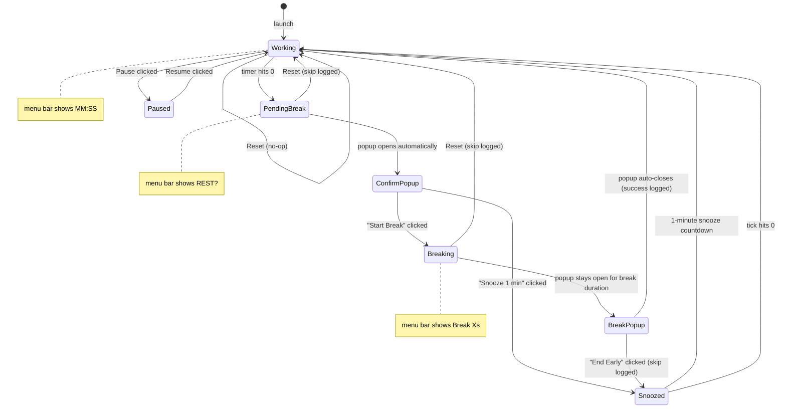

# Eye Strain Timer

A macOS menu bar app that enforces the 20-20-20 rule to reduce eye strain during screen time.

## Background

The 20-20-20 rule: every 20 minutes, look at something 20 feet away for 20 seconds. This app automates the reminder and tracks compliance over time.

## State Diagram



## Product Requirements

- **Countdown**: display a live `MM:SS` countdown in the menu bar
- **Break prompt**: after 20 minutes, show a native macOS popup asking the user to confirm the break
- **Break display**: once confirmed, a second popup stays on screen for the break duration and auto-closes on completion
- **Snooze**: dismiss the break popup early (or choose Snooze at the prompt) to snooze for 1 minute; counts as a skip
- **Auto-cycle**: after the break completes, reset and start the next 20-minute work interval automatically
- **Pause / Resume**: manually pause and resume the work timer
- **Reset**: cancel current state and restart the work timer; counts as a skip if triggered during a break
- **Sleep awareness**: timer pauses on system sleep; on wake, the work timer resets to 20:00
- **Break tracking**: log every break to `~/.eye-strain-timer/log.csv` with a timestamp and result (`success` or `skipped`); display today's score as `Today: X/Y` in the menu
- **Singleton**: only one instance runs at a time; a second launch exits immediately

## Implementation

**Language / framework**: Python 3.9+, [`rumps`](https://github.com/jaredks/rumps) for the menu bar UI.

**Break popup flow**: a background thread runs `osascript` to show native macOS dialogs. The thread sets a `_popup_response` flag (`"done"` or `"snooze"`) which the main tick loop reads on the next tick — keeping all state mutations on the main thread.

**Sleep / wake detection**: `NSWorkspaceWillSleepNotification` / `NSWorkspaceDidWakeNotification` via PyObjC. A `SleepWakeObserver` NSObject subclass registers for these and calls back into the app.

**Singleton**: on launch, writes PID to `/tmp/eye-strain-timer.lock`. If the lockfile exists and the PID is alive, the new process exits. Lockfile is removed via `atexit` and a `SIGTERM` handler (so `pkill` cleans up correctly).

**Break log**: append-only CSV at `~/.eye-strain-timer/log.csv`. Columns: ISO 8601 timestamp, result. Today's counts are loaded at startup and maintained in memory to avoid per-second file reads.

## Project Structure

```
src/app.py        # main app
tst/test_app.py   # unit tests (pytest)
restart.sh        # kill + relaunch helper
requirements.txt
```

## Setup

```bash
python3 -m venv .venv
source .venv/bin/activate
pip install -r requirements.txt
python src/app.py
```

## Development

Override the work timer to test break flow quickly:

```bash
./restart.sh --work 60       # 1-minute work timer
./restart.sh --work 10       # 10-second work timer
./restart.sh                 # normal 20-minute timer
```

Run tests:

```bash
source .venv/bin/activate
python -m pytest tst/ -v
```

## Log Format

```
2026-04-17T09:14:00,success
2026-04-17T09:35:22,skipped
2026-04-17T09:57:00,success
```
